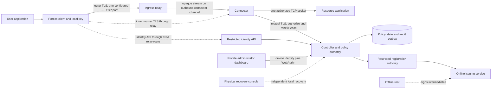

# Portico architecture

Status: Phase 0 proposal. Logical boundaries are selected; transport and platform integrations have explicit validation gates.

## Chosen architecture
Use a resource-oriented TCP proxy with centralized, online authorization and independently enforced connector hosting permissions. Connectors establish outbound infrastructure connections. Clients never receive layer-3 access to the connector network. The proposed baseline uses standard TLS 1.3 for endpoint authentication and confidentiality, with a relay carrying opaque streams. The exact reverse-stream adapter is provisional (Q01).

The arrows for inner TLS describe logical endpoint-to-endpoint authentication, not another public port. Application TLS or SSH remains intact inside Portico and should authenticate the destination separately.

## Components and privileges
| Component | Owns | May do | Must not possess |
|---|---|---|---|
| Controller / policy authority | Users, devices, resources, grants, policy generation, session ledger | Authorize individual streams; transact mutations and audit | Device private keys; offline root private key |
| Restricted identity API | Enrollment and own-device lifecycle handlers | Accept scoped invitations and CSRs; expose own allowed catalog | Administrative CRUD routes or generic CA proxy |
| Dashboard / management API | Admin UX and operation-specific handlers | Display effective changes and request step-up approval | Alternate authorization path; browser-stored enrollment secrets |
| Relay | Connection admission, pairing, bounded queues | Carry opaque client/connector streams; enforce infrastructure quotas | Resource plaintext, issuer key, management credentials, authority to mint grants |
| Connector | Assigned destination definitions and active socket handles | Verify client certificate; request online authorization; dial exact allowed tuple | User administration, global policy writes, unrelated resource inventory |
| Client | Local private key and authorized resource catalog | Prove device identity; open explicit local resource connection | Authority to choose connector destination address or grant itself access |
| Registration authority / issuer | Approved issuance requests and online intermediate | Issue exact approved certificate profile | Generic client-accessible signing or unrestricted renewal |
| Audit exporter | Committed, redacted security events | Export to independent append-only destination | Mutate policy or recover private keys |
| Recovery console | Explicit host-owner recovery capability | Quarantine and restore administrative control locally | Unauthenticated HTTP recovery endpoint |

For the initial self-hosted controller, recommend a single authoritative writer with transactional SQLite storage on a local filesystem. No network-share database, multi-writer HA, or read-replica authorization. Phase 2 selects modernc.org/sqlite with transactional migrations in ADR-002; protect the filesystem and backups. High availability is later architecture work, not implied by having several connectors.

Separate processes, OS identities, sockets, and mounts are required for issuer, relay, and controller in the deployment design. Co-location on the same root-controlled host does not protect against host root. Policy may be a controller module; it is authoritative even if no separate policy server process exists.

## Connection sequence
1. The enrolled client authenticates to the restricted identity API using its device certificate and receives only its currently allowed catalog. Inventory is advisory; it is never authorization.
2. A resource request supplies immutable resource ID and expected revision. Relay selection gives no destination freedom. The relay pairs a bounded stream with an authenticated connector that has hosting permission.
3. Across the stream the client and connector perform **inner mutual TLS**. The connector derives the principal from the verified leaf and registered certificate record. The client validates the expected connector ID, certificate role, issuer and current status through the identity API.
4. Inside that authenticated stream, the client requests the resource ID. The connector submits the observed certificate identity, its own authenticated connector identity, resource revision and proposed resolved IP to the controller.
5. The controller checks all live states and creates a short-lived session authorization record. The connector validates the reply against its local immutable resource snapshot, opens only that IP/port, and records activation. No application bytes flow before activation succeeds.
6. The connector enforces expiry, lease refresh and cancellation. Revocation closes both stream and destination socket. Each new local connection requires a fresh authorization, even over reused infrastructure channels.

The relay cannot authorize on a client-supplied username or assert that an unverified device is Alice. A malicious relay can deny service, observe metadata and mispair streams; inner TLS and connector authorization must reject identity substitution. A compromised connector can abuse its own destination reachability; independent egress controls limit this blast radius.

## Management and enrollment reachability
The dashboard and management API have no public ingress route. After bootstrap they are accessible through an explicit administrator-only Portico resource with a dedicated management connector that has no general workload access. Certificate identity and fresh WebAuthn are still checked at the management boundary.

A fixed restricted identity-service route shares the infrastructure port for invitations, own-device enrollment/renewal and catalog access. It is a different API surface from management. Only enrollment may be pre-certificate, using verified server trust and a single-use invitation. Rate limiting and request limits precede expensive parsing. There is no arbitrary URL/host proxy.

Browser-to-device certificate binding and stable WebAuthn origin are a blocking Q02. The proposed companion-agent approach must preserve certificate authentication at the server; headers from an arbitrary browser, relay or connector are not identity evidence. See [bootstrap](BOOTSTRAP_AND_RECOVERY.md).

## Technology and protocol decisions
Go is the recommended controller/connector/core language; Kotlin owns Android platform integration. Recommend TypeScript with Angular Material for the dashboard, subject to dependency review. The data plane stays outside the web runtime. Details and alternatives are in [ADR-001](ADR-001-implementation-language.md).

Prefer restricted self-hosted Smallstep step-ca behind a Portico registration authority, not new CA machinery. Prove that direct provisioner and renewal paths cannot bypass Portico authorization before adopting it. [Protocol design](PROTOCOL_DESIGN.md) compares native TLS streams with embedding OpenZiti, HTTP CONNECT and QUIC.

## Availability and failure policy
No new data session when the controller, certificate status, audit commit, destination validation, clock health or protocol negotiation is unavailable. Existing streams have short finite leases and receive prompt cancellation when connected. Recovery remains local and independent. Finite leases deliberately trade availability for contained stale authority.

One configured external **TCP** port is the target baseline. Using the same numeric TCP and UDP port later would mean two protocol exposures. Double NAT needs reachable forwarding through both boundaries; CGNAT may require a later externally reachable relay. No UPnP, DMZ, auto-forwarding or router vendor assumptions.

## Validation
Every security claim above is a design requirement. [Control matrix](SECURITY_CONTROL_MATRIX.md) records threat, mechanism, trust, failure, recovery and proof for each. Q01, Q02 and Q03 must be resolved before exposing even an isolated connector prototype to hostile test clients.
