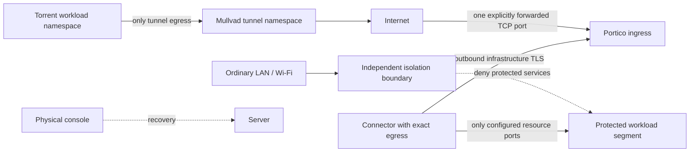

# Network isolation and Mullvad coexistence

Status: Phase 0 deployment design only. No firewall, router, VPN, container or server networking has been changed.

## Supported target topology

Names, IPs, NAT chain and ports are configuration. No dependence on Plusnet, TP-Link, AX18, a particular subnet, UDP/51820 or a fixed public address. A separate router may strengthen segmentation but is not required. A gateway VM or host boundary can supply it.

One-port target means one configured external **TCP** listener for infrastructure, including relay and restricted identity enrollment traffic. Management/dashboard and individual resources are not public. QUIC would require UDP reachability and separate qualification; a shared number for TCP/UDP is still two protocol exposures.

Double NAT needs an explicit reachable forwarding path across both NATs. CGNAT may prevent inbound service; a future reachable relay/VPS can address this. No DMZ, UPnP/NAT-PMP or automatic router changes. Hairpin NAT limitations affect reachability, not authentication.

## Ordinary LAN exclusion
Initial supported production profile should place protected workloads in a segment not directly reachable by ordinary LAN clients. Use an independently enforced gateway/VM/host boundary and explicit connector egress rules. Host SSH is also protected; physical console remains available.

Inventory every interface/address, including IPv6 global/ULA/link-local addresses, Docker bridges, secondary NICs and service listeners. Test from an actual separate untrusted network, not just from the server itself. Do not consider hiding DNS names or binding only IPv4 to be isolation.

An authorized SSH service may support forwarding or a shell. An HTTP application may implement a proxy or be exploited. Portico cannot eliminate these onward capabilities by authorizing TCP/22 or TCP/8096. Use destination egress restrictions and application configuration to contain them.

## Docker design
Controller, issuer and connector use separate identities, read-only image roots, explicit writable state mounts, no secrets baked into images, no Docker socket mounts and no privileged mode. Connector workloads require neither host networking nor NET_ADMIN. Host networking and arbitrary published protected ports are outside the initial supported profile.

Protected containers have no application `ports:` publication. Private bridges alone are insufficient: the connector could reach every service sharing that bridge. Prefer dedicated workload segments/bridges plus egress allowlists. A connector with multiple interfaces must not forward between them.

Docker's packet path can bypass ordinary host INPUT filtering; its official documentation warns that published traffic can bypass ufw. Its nftables backend is separately documented and currently marked experimental. [Packet filtering](https://docs.docker.com/engine/network/packet-filtering-firewalls/) · [nftables backend](https://docs.docker.com/engine/network/firewall-nftables/).

Qualification must cover:
- iptables backend: relevant forwarded traffic, DNAT/original tuple behavior, DOCKER-USER policy and direct host services.
- nftables backend: independent correctly ordered hook chains; do not assume DOCKER-USER exists.
- IPv4 and IPv6, direct container routing, bridge ingress, host listeners and all external interfaces.
- Container restart, daemon restart, host reboot and accidental publication.
- An independent isolation boundary that still blocks ordinary LAN access when a protected port is accidentally published.

A detector/Compose linter reports misconfiguration but cannot retroactively protect a public socket. Backend/kernel/Engine versions must be recorded. Do not disable Docker firewall management or globally alter FORWARD policies as a generic fix. Root compromise can remove these controls.

## Server Mullvad coexistence
Preferred design: the torrent workload resides in a dedicated network namespace/container/VM with Mullvad Internet egress and a fail-closed egress firewall. Portico infrastructure uses a different routing domain. The workload has no alternate non-tunnel default route, no route through a connector and no generic Portico Internet proxy.

Retain qBittorrent's interface binding as defense in depth, but do not treat application binding alone as the kill switch. The exact application/VPN version behavior must be tested. If exposing its management UI as a resource later, use a narrowly controlled local management boundary; never add a general LAN or connector route to its namespace.

The existing server may instead use a host-wide Mullvad installation. Portico must detect conflicts and report unsupported automatic configuration. Migration to workload isolation is an explicit operator project with console/rollback, not an installer action. Existing routes, DNS and kill-switch rules remain untouched.

Mullvad documents that split-tunnel exclusions send excluded applications outside the VPN; therefore broad exclusion is not a safe generic repair. [Mullvad split tunneling](https://mullvad.net/en/help/split-tunneling-with-the-mullvad-app).

## Tests and observability
Build an isolated VM lab containing untrusted LAN, dual-stack protected resources, connector, ingress, controller, and torrent/VPN namespace. The “Internet” sink is owned test infrastructure; no public scanning or third-party torrent activity.

Use synthetic tunnel fault tests first. A later real Mullvad client/account test in that lab is required before claiming Mullvad compatibility; a mocked VPN is not sufficient. Generate harmless owned test payloads. Capture packets on tunnel and physical egress; verify the torrent payload reaches the physical interface only as encrypted tunnel traffic.

Inject tunnel teardown, DNS failure, client crash, interface rename, reboot, reconnect and Portico start/stop. Portico resource access should continue through its separate domain; torrent Internet must stop when VPN protection fails.

NET-01–08 and VPN-01–05 define exact expected outcomes. Firewall rollout later requires inventory, dry run, effective-policy preview, backup, timed rollback armed before apply, physical console, health verification and explicit persistence. Never run these experiments on the developer's real network.
